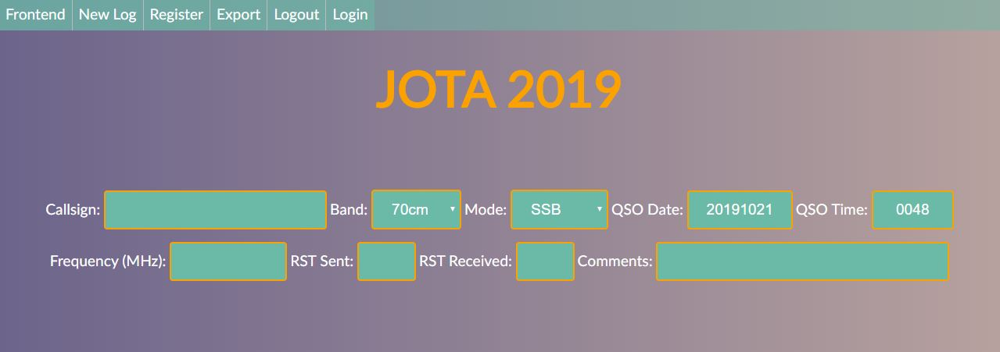

# Table of Contents

- [Introduction](https://github.com/gw3uws/SRSLog/#introduction)
	- [What is it?](https://github.com/gw3uws/SRSLog/#what-is-it)
	- [What can it do?](https://github.com/gw3uws/SRSLog/#what-can-it-do)
	- [What does it look like?](https://github.com/gw3uws/SRSLog/#what-does-it-look-like)
	- [Is it safe?](https://github.com/gw3uws/SRSLog/#is-it-safe)
- [Requirements](https://github.com/gw3uws/SRSLog/#requirements)
- [Roadmap](https://github.com/gw3uws/SRSLog/#roadmap)
- [Installation](https://github.com/gw3uws/SRSLog/#installation)

# Introduction

### What is it?
Amateur Radio logging software, designed to run offline (there's not always internet at special event stations), and be very simple to use. 

### What can it do?
- Basic logging to a database
- Multiple simultanious users (authenticated)
- ADIF Export
- "Frontend" that can be used to track progress

### What does it look like?
The UI is completely configurable through CSS (bootstrap is a feature request). Feel free to brand it however you like!

#### Frontend

#### New Contact

#### ADIF Export


### Is it safe?
Maybe. It's best that don't put it public facing, I can't remember if it has SQL Injection countermeasures. Most of all, if you really care about your log, think about backing it up regularly (this could be easily automated through the ADIF export script). 

Passwords are hashed and salted, using BCrypt.

# Requirements
Linux box with LAMP (runs nicely on a Pi 1 or above)

# Roadmap

- Initial Setup - MySQL tables + user accounts
- Multiple events - get rid of hardcoded events, add user wizard for creating a new event
- [Feature Requests](https://github.com/gw3uws/SRSLog/issues)

# Installation

- Setup a linux box with [LAMP](https://howtoubuntu.org/how-to-install-lamp-on-ubuntu)
- Clone the github directory into /var/www
```
cd /var/www
git clone https://github.com/gw3uws/SRSLog
```
- Set a root password for mysql:
```
sudo mysql_secure_installation
```
- Enter mysql
```
sudo mysql -u root -p
```
- Create a new user (please change the password): 
```
CREATE USER 'srslog'@'localhost' IDENTIFIED BY 'changeme';
```
- Create a new database
```
CREATE DATABASE srslog_db;
USE srslog_db
```
- Grant user privileges
```
GRANT ALL PRIVILEGES ON *.* TO 'srslog'@'localhost' WITH GRANT OPTION;
```
- Add a table to the database (Right; I don't know why this is called eventname. I basically want a fresh SQL table for each "event" the logging software is used for. Hopefully this will make more sense once I've worked through the roadmap a bit further)
```
CREATE TABLE `srslog_db`.`eventname`
 ( `LogID` INT NOT NULL AUTO_INCREMENT ,
   `Call` TEXT NOT NULL , 
   `QSO_Date` TEXT NOT NULL ,
   `Time_On` TEXT NOT NULL , 
   `Band` TEXT NOT NULL ,
   `Mode` TEXT NOT NULL ,
   `Freq` TEXT NOT NULL , 
   `RST_Sent` TEXT NOT NULL ,
   `RST_Rcvd` TEXT NOT NULL , 
   `Notes` TEXT NOT NULL , PRIMARY KEY (`LogID`)
 );
 ```
 - Create another table:
 ```
 CREATE TABLE `srslog_db`.`event`
 ( `EventID` INT NOT NULL AUTO_INCREMENT ,
   `Name` TEXT NOT NULL ,
   `Description` TEXT NOT NULL,
   `Image` TEXT NOT NULL ,
    `URL` TEXT NOT NULL , PRIMARY KEY (`EventID`)
 );
 ```
 - Insert an event
 ```
 INSERT INTO `event` 
  (`EventID`, `Name`, `Description`, `Image`,`URL`)
 VALUES
  (NULL, 'JOTA 2019', 'Jamboree On The Air','https://www.jotajoti.info/sites/default/files/images/logo/ls_0.png','https://www.jotajoti.info/');
```
 - Create the user table:
 ```
 CREATE TABLE `srslog_db`.`users`
 ( `UserID` INT NOT NULL AUTO_INCREMENT ,
   `username` TEXT NOT NULL ,
   `password` TEXT NOT NULL, PRIMARY KEY (`UserID`)
 );
 ```
 - Insert a user (Okay, I admit, this is a horrible way to do things. However, it'll do for now, until I write a proper script for doing an initial setup. Also it's salted. And we delete it later.)
 ```
 INSERT INTO `users` 
  (`UserID`, `username`, `password`)
 VALUES
  (NULL, 'backdoor', '$2y$10$srRxSt8x39qe3dF9oc402.DA20TXOOcv9guWL9T2QqESzIlGq0jPa');
```
- Exit mysql
```
exit
```
- Edit srslog/users/connect.php to match your MySQL server login
```
nano database/connect.php
```
- Go to http://yourip/ and hopefully you'll see the website runnign
- Click 'login' at the top-right corner
- Login with the following credentials: "backdoor" and "password"
- Click "register"
- Register the new user
- Enter mysql
```
sudo mysql -u root -p
USE srslog_db
```
- Delete backdoor user
```
DELETE FROM users
WHERE username = 'backdoor';
```

__That's It! Congratulations__
